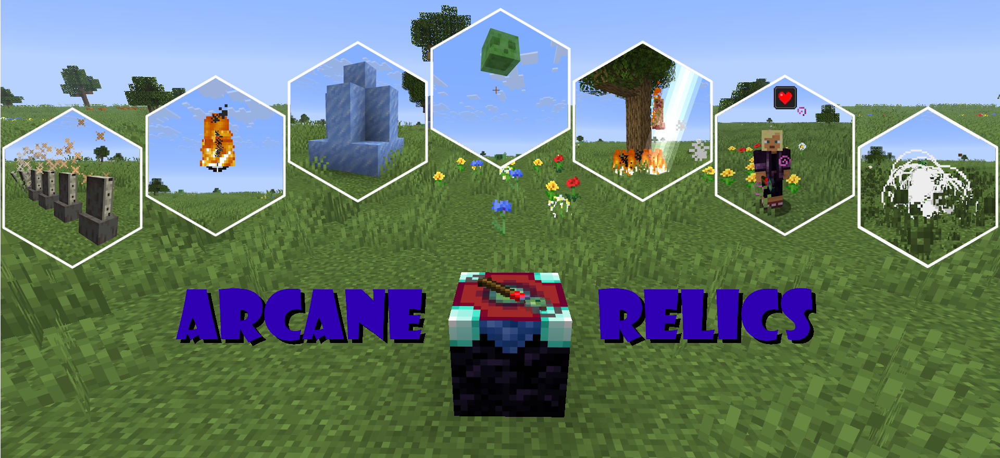
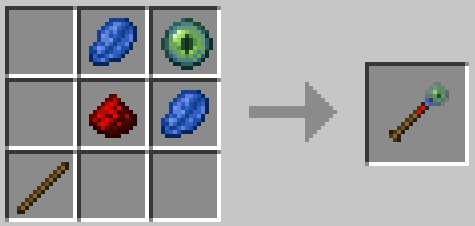
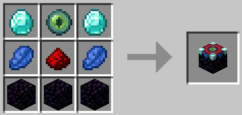
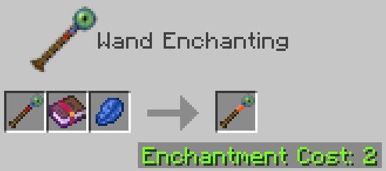

# Arcane Relics



_A collection of powerful relics from crafty wizards_

**Arcane Relics** is a Fabric mod for Minecraft `1.21.11` that adds charged magic wands, a **Wand Enchanting Table**, and progression built around enchanting and recharging those wands.

At a glance, the mod adds:

- an inert **Arcane Wand** that serves as the base wand item
- a **Wand Enchanting Table** used to enchant and recharge wands
- multiple specialty wands with different casting behavior
- alternate recharge mechanics for most wands

<details>
<summary>SPOILERS: Crafting Recipes</summary>

**Arcane Wand**



**Wand Enchanting Table**



</details>

**Wand Enchanting Table** UI


## Installation

### Players

Arcane Relics is a [Fabric](https://fabricmc.net/) mod.

Required:

1. Minecraft `1.21.11`
2. Fabric Loader
3. Fabric API
4. The Arcane Relics mod `.jar`

Optional client-side companions:

- **JEI** for recipe browsing
- **Mod Menu** for mod list integration
- **YACL** for the client config screen used by this mod

To install:

1. Download the latest release from the [Releases](https://github.com/willihay/arcane-relics/releases) page.
2. Install Fabric Loader for Minecraft `1.21.11`.
3. Put `Fabric API` and `Arcane Relics` into your `mods` folder.
4. Optionally add JEI, Mod Menu, and YACL on the client.
5. Launch the game.

### Server admins

For a dedicated server, install:

1. Fabric Loader for `1.21.11`
2. Fabric API
3. Arcane Relics

JEI, Mod Menu, and YACL are not required on the server.

## How to play

### 1. Craft the basics

Start by crafting:

- an **Arcane Wand**
- a **Wand Enchanting Table**

The Arcane Wand is intentionally inert by itself. It must be enchanted before it can cast anything.

### 2. Enchant a wand

Use the **Wand Enchanting Table** to turn an Arcane Wand into a specialty wand.

The table uses:

- a wand in the wand slot
- an arcane ingredient that determines the output wand
- **Lapis Lazuli**

Some enchantments also cost XP, depending on server config.

<details>
<summary>SPOILERS: Wand Enchanting Example</summary>

**Arcane Wand** + **Book of Flame** + **Lapis Lazuli** -> **Fireball Wand**



</details>

### 3. Use wand charges

Specialty wands have limited charges.

- Use the wand normally to cast.
- Some wands become stronger if you **hold use** before releasing.
- Charges are spent when casting successfully.

### 4. Recharge a wand

There are two main recharge paths:

1. **Wand Enchanting Table recharge**  
   Enchant an already enchanted wand again with the same ingredient to restore charges.

2. **Alternate recharge source**  
   Most specialty wands can also be recharged for free by **sneak-using** them near a specific mob or block.

## Wands and alternate recharge sources

<details>
<summary>SPOILERS: Table of Wands</summary>

| Wand | Main theme | Key ingredients                                                                                | Alternate recharge source |
| --- | --- |------------------------------------------------------------------------------------------------| --- |
| Fang Wand | Evoker-style fangs | Totem of Undying                                                                               | Evoker |
| Fireball Wand | Fireball projectile | Book of Flame                                                                                  | Blaze or any type of Ghast |
| Ice Wand | Ice imprisonment | Book of Frost Walker                                                                           | Stray |
| Levitation Wand | Shulker projectile and self-lift | Shulker Shell                                                                                  | Shulker |
| Lightning Wand | Lightning strike | Book of Channeling                                                                             | Lightning Rod during a thunderstorm |
| Regeneration Wand | Regeneration effect | Golden Apple; Enchanted Golden Apple; Any Potion of Regeneration; Tipped Arrow of Regeneration | Happy Ghast |
| Wind Wand | Gust attack | Book of Wind Burst; Potion of Wind Charged                                                     | Breeze |

</details>

## Notes for players

- The **Arcane Wand** is the base input wand, not a combat wand.
- Re-enchanting a wand with a different valid ingredient can transform it into another wand type.
- Wands show their charge count in the tooltip.
- Advancement progress is tied to enchanting and recharging different wands.

## Server configuration

Arcane Relics stores its gameplay config per world in:

```text
<world save>\data\arcane-relics\server-config.json5
```

This file controls gameplay settings such as wand balance and Wand Enchanting Table behavior.

### Admin commands

Arcane Relics registers the `arcrel` admin command root.

Useful subcommands:

```mcfunction
/arcrel config reload
/arcrel config reset
```

- `reload` reloads the world config from disk and syncs it to connected players
- `reset` restores defaults and writes them back to disk

These commands require admin/operator-level permissions.

## Optional client features

If the optional client mods are installed:

- **JEI** can help players browse the normal crafting recipes and enchanting-table outputs
- **Mod Menu** exposes the mod cleanly in the mod list
- **YACL** enables this mod's client config screen

These are convenience features, not hard requirements for gameplay.

## Documentation for maintainers and contributors

Additional project documentation lives under `docs/`:

- `docs/design-notes.md` - architecture and design overview
- `docs/pull-request-notes.md` - conventions for contributions and pull requests

## Contributing

Issues, suggestions, and pull requests are welcome on the [GitHub repository](https://github.com/willihay/arcane-relics).

This repository uses a branch-per-Minecraft-version workflow. The default branch tracks the current supported version line, and version-specific work should target the matching `mc-*` branch such as `mc-1.21.11`.

Additional translations of the language files into other languages are also very welcome. If you would like to help translate the mod, feel free to submit them through GitHub issues.

If you want a quick project overview before contributing, start with `docs/design-notes.md`.

## License

**Arcane Relics** is licensed under the GNU LGPLv3 license.

High-level, this means:

- you can include the released mod in **modpacks**
- you can **fork** the project and modify it
- you can reuse code from this project in your own mods, as long as you follow the LGPL's conditions
- if you distribute a modified version of Arcane Relics itself, you must keep that LGPL-licensed part under the same license and make the corresponding source available
- you must keep the copyright and license notices with the project

Common practical cases:

- **Modpacks:** generally allowed
- **Forks:** allowed, including public forks and modified redistributions, if you keep the license terms
- **Using parts of the code in another mod:** allowed, but the LGPL terms matter for the reused LGPL-covered code
- **Private modifications for personal use:** allowed

This is only a brief practical summary, not legal advice.

See:

- [LICENSE](LICENSE)
- [LICENSE.LESSER](LICENSE.LESSER)

If you plan to redistribute code or binaries derived from this project, read the full license text.
